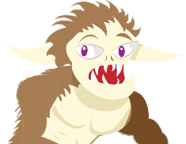
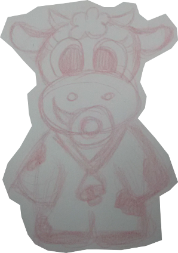

# Zé do Rego foge da Abraça-Monstro

> Zé do Rego é um [Arranca-Línguas](http://www.consciencia.org/lenda-do-arranca-lingua-folclore-brasileiro), uma aterrorizante criatura da mitologia brasileira (originário da região de Aruana, porto fluvial do Araguaia, em Goiás), semelhante a um grande e peludo homem-gorila que se alimenta das línguas de vacas. Os que o encontraram e sobreviveram relatam sua ferocidade, e as vacas tremem à mera menção de seu nome. Apenas a vaquinha Lili não tem medo dele! Pelo contrário, ela apenas deseja cobri-lo de abraços por ele ser tão fofinho (na opinião dela, claro). Zé, que não deseja essa atenção, não tem o que fazer além de fugir pra muuiiiitooo longe dessa Abraça-Monstro...

## Introdução

Zé do Rego foge da Abraça-Monstro é um jogo de aventura no estilo *point-and-click* em que o jogador controla a vaquinha Lili passando por várias fases em busca do monstro que fugiu para muito longe dela. O jogo utiliza em sua fantasia e mecânica a temática dos antigos desenhos animados (como Droopy, Scooby Doo, Pica-Pau, Pernalonga e outros tantos desenhos produzidos por Walter Lantz e Tex Avery), utilizando cenas e referências a situações cômicas "absurdas", tais como elevadores dentro de árvores, bigornas e pesos de 1 tonelada, corredores com portas que teletransportam entre si, etc.

O objetivo do jogo é solucionar os *puzzles* de cada fase de forma a progredir na busca pelo monstro fugido.

### Características

* Plataformas: Web e mobile.
* Arte: Cartunesca, seguindo o estilo dos desenhos que inspiram o jogo.

## Personagens

Os textos a seguir são apresentados aos jogadores em uma tela específica do jogo (um *about* dos personagens).

### Zé do Rego

Zé do Rego é um Arranca-Línguas, uma criatura meio homem/meio gorila que aterroriza os criadores de gado (na verdade ele aterroriza ainda mais as vacas, mas como elas não falam e não têm um sindicato forte, ninguém dá a mínima). Há quem diga que ele é só uma lenda, e que as vacas na verdade morderiam a própria língua devido à coceira ocasionada por um tipo específico de febre afitosa e... Bobagem! Ele é muito real, e você faz muito bem em não duvidar - a dúvida  vai fazer você se sentir seguro, principalmente se não for uma vaca; mas, vai saber, Zé do Rego pode decidir variar o cardápio, e ai já viu né?

Por ser meio homem, Zé do Rego tem a capacidade de falar. Mas ele não lê jornal, não joga videogame e não pega fila de banco, então ele simplesmente não fala porque não tem muito o que contar (talvez por isso ele seja assim tão furioso, mas eu divago). Por ser meio gorila, ele é grande, forte, peludo e selvagem. Ele tem grossos pelos negros, principalmente no peito e nos largos braços (ah, e na bunda). Ou seja, tirando o fato de ele ser um híbrido de símio e humano, ele é praticamente o seu Manoel da padaria.

A família *do Rego* é bastante tradicional nas matas às margens do Araguaia, tendo até uma curva de rio nomeada em sua homenagem (a famosa Curva do Rego; não conhece?). Mas Zé é o último de sua espécie e isso é muito triste: ele não tem uma namorada (ou namorado; não sejamos preconceituosos) com quem compartilhar uma bela língua (#tudumtss).

Zé não teme nada no mundo! Quer dizer, Zé não teme *quase nada* no mundo, exceto essa vaquinha pentelha que vive querendo abraçá-lo dizendo que ele é "fofinho". Onde já se viu uma coisa dessas?

### Lili

Lili é uma vaca. Não, eu não a estou ofendendo: ela *é mesmo* uma vaca (o animal). Mais precisamente, ela é uma bezerra recém-desmamada que acha que tem idade pra ir nos bailinhos, mas suas tetas (posso falar "tetas" nesse horário?) nem cresceram ainda. Seu pai é gerente de projetos em uma startup de inovação na fabricação de iogurtes light e sua mãe é atriz aposentada - seu último trabalho foi figuração (só das pernas!) em um desenho do Platoon Network que foi cancelado (eu acho; não tenho certeza porque agora eu só assisto Netfreak).

Os pais da Lili são muito ocupados, e fora muita grana eles não dão mais nada pra ela. Assim, ela é uma vaquinha mimada que acha que pode ter o que quiser, quando quiser. Geralmente ela tem mesmo: ela tem um iMuuone que usa pra jogar Milkbar Crush, acessar o HornBook e ouvir as músicas do Justin Boiber. Vai no pancadão do FreeBoy e gasta R$ 2.000,00 todo final de semana em frisante caro que todos teimam em chamar de Champagne no camarote (Lili suborna o segurança pra poder beber, mesmo sendo di-menor).

A única coisa que ela ainda não conseguiu ter foi o Zé do Rego. Ah, mas quando ela o pegar... que abraço gostoso ele vai ganhar, viu? As pessoas dizem pra ela tomar cuidado porque o Arranca-Línguas arranca línguas (jura?), mas sua paixão por ele é tamanha que ela simplesmente não consegue ter medo. Ou não quer, sei lá. Vai ver é fetiche (novamente, não sejamos preconceituosos).

O problema é que Zé do Rego sempre foge das investidas de Lili, e como ela tem perninhas curtinhas (e ainda por cima corre só em duas pernas, vai entender...) ela quase nunca o alcança. Mas, dessa vez, ela vai ser um pouco mais esperta. Veremos.

## Mecânica

### Opções de Ação

* **Abrir**. Permite abrir objetos ou personagens que oferecem essa possibilidade de interação.
* **Fechar**. Permite fechar objetos ou personagens que oferecem essa possibilidade de interação.
* **Pegar**. Permite pegar objetos ou personagens que oferecem essa possibilidade de interação.
* **Observar**. Permite observar as características de objetos ou personagens e tecer comentários que auxiliam o jogador.
* **Falar com**. Permite iniciar diálogos com objetos ou personagens.
* **Usar**. Permite utilizar objetos ou personagens uns com os outros.
* **Empurrar**. Permite empurrar objetos ou personagens que oferecem essa possibilidade de interação.
* **Puxar**. Permite puxar objetos ou personagens que oferecem essa possibilidade de interação.

Atenção: No escopo do SPJam 2015, vamos utilizar apenas as seguintes ações: Observar, Usar, Falar com, Pegar. Elas serão usadas de uma forma mais ampla (por exemplo, Usar pode ser usada para abrir e fechar portas).

## Métodos de Interação

### Interação na plataforma Web

A interação com o jogo ocorre por meio do ponteiro do mouse.

1. Seleção de opções de menu. O jogador clica sobre a opção do menu desejada, e a ação é imediatamente executada.

2. Movimentação da vaquinha Lili. O jogador clica em qualquer área do cenário e a vaquinha se aproxima da área clicada, se existir um caminho no cenário que leve até o local clicado.

3. Seleção de opções de ação. O jogador clica sobre uma opção de ação desejada, e ela é realçada na tela. Então, o jogador clica sobre um objeto ou personagem do cenário. O realce da opção de ação é imediatamente eliminado e a opção de ação é imediatamente executada sobre o objeto ou personagem escolhido.

### Interação na plataforma Mobile

A interação com o jogo ocorre por meio do toque na tela (com um dedo).

1. Seleção de opções de menu. O jogador toca sobre a opção do menu desejada, e a ação é imediatamente executada.

2. Movimentação da vaquinha Lili. O jogador toca em qualquer área do cenário e a vaquinha se aproxima da área clicada, se existir um caminho no cenário que leve até o local tocado.

3. Seleção de opções de ação. O jogador toca sobre uma opção de ação desejada, e ela é realçada na tela. Então, o jogador toca sobre um objeto ou personagem do cenário. O realce da opção de ação é imediatamente eliminado e a opção de ação é imediatamente executada sobre o objeto ou personagem escolhido.

## Telas

### Menu Inicial

A tela do menu inicial apresenta uma animação em que Zé do Rego constantemente foge de Lili ao redor de um globo terrestre. Eles alternam ao aparecer na tela. Primeiramente, Zé aparece do lado direito, iniciando a sua volta ao mundo, para na frente dele, olha para os lados preocupado, e continua seu trajeto para a esquerda. A cada aparição, ele usa um veículo diferente: um balão, um trem, um triciclo, etc. Assim que ele vai para o lado de trás do globo, Lili aparece na direita. Ela também para  na frente do globo e olha para os lados, mas com uma expressão animada e saltitante. Ela sempre está a pé, saltitando (passando a impressão de que ela jamais alcancará Zé - expectativa a ser frustrada no final do jogo).

## Cenas

### No Colégio

Esta é a cena inicial, que se passa no colégio em que Lili estuda. Enquanto estava na aula de Cálculo II, Lili vê Zé do Rego passando pela janela fechada. 